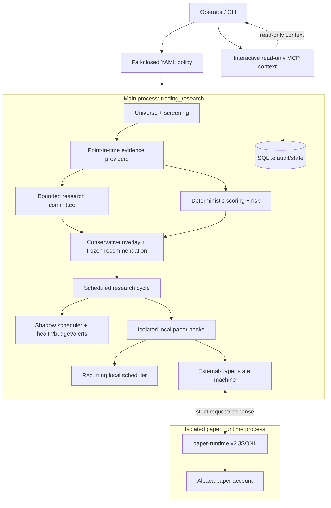

# Agentic Trading Desk

[](https://github.com/jijoece/ai_stock_trading/actions/workflows/ci.yml)
[](pyproject.toml)
[](LICENSE)
[](#safety-and-integrity-guarantees)

An evidence-backed, local-first research and paper-trading platform that keeps
financial computation deterministic, model reasoning bounded, and execution
authority under explicit operator control.

> **Research and paper trading only. Live/real-money trading is not implemented.**
>
> The repository supports deterministic local simulation and a separately
> isolated, operator-initiated Alpaca **paper-account** path. The external path
> is disabled by default, accepts only bounded LIMIT/DAY whole-share orders,
> and cannot be reached by the recurring scheduler without a separate operator
> preview and submission command.

The governing rule is:

> **Python computes. Models analyze bounded evidence. Policy gates authority.
> The operator decides.**

## Why this project?

Most AI trading demos collapse research, judgment, accounting, and execution
into one opaque agent loop. This project separates them:

- deterministic Python owns indicators, scoring, risk, cash, positions, and
  order state;
- evidence providers preserve point-in-time source data and provenance;
- models can analyze only bounded, validated evidence;
- SQLite records the decisions, attempts, failures, events, and reconciliations;
- every capability ships disabled or bounded according to its risk;
- real-money execution remains structurally unavailable.

The result is a system designed for reproducibility, paper experimentation,
failure analysis, and operational safety—not autonomous trading.

## Features

| Area | What the project provides | Default posture |
|---|---|---|
| Deterministic analysis | Universe validation, hard screening gates, composite scoring, technical indicators, risk sizing, immutable recommendations | Available offline |
| Evidence acquisition | SEC EDGAR filings/fundamentals, Alpaca market data and news, Reddit sentiment, provider caching and provenance | SEC enabled; credentialed providers disabled |
| AI research committee | Fundamental, technical, bull, bear, and manager roles with schema/claim validation, retries, usage tracking, and deterministic replay | Deterministic provider; real model calls disabled |
| Scheduled research | Bounded multi-symbol cycles, resumability, point-in-time checks, failure persistence, and forward evaluation | Disabled |
| Shadow operations | Market-day scheduling, singleton leases, budgets, health diagnostics, alerts, pause/kill state, and readiness reports | Disabled |
| Isolated paper portfolios | Independent `BASELINE` and `ENHANCED` books with separate cash, lots, positions, fills, snapshots, valuation, and reconciliation | Subsystem disabled |
| Experiment evaluation | Baseline/enhanced comparisons, calibration, turnover, time-to-fill, cross-book verification, and advisory promotion evidence | Read-only/advisory |
| Position lifecycle | Pending-order handling, ATR stops, trailing/breakeven protection, deterministic partial profits, maximum holding period, reversal exits, and explicit manual exits | Disabled |
| Advanced risk validation | Persisted daily-loss/drawdown breakers, point-in-time economic blackout boundary, and deterministic daily-bar control backtests | Disabled / offline |
| Controlled soak campaigns | Bounded multi-day campaigns, resumable attempts, activation reviews, evidence integrity, and operator reports | Disabled |
| Recurring local paper runs | Explicit review/request/activation flow, frozen-cycle queue, schedule, lease, and pre-run safety gates | Disabled |
| Alpaca paper boundary | Isolated runtime process, account checks, preview, explicit submit/cancel, fills, reconciliation, and guarded retry | Disabled; paper account only |
| Audit and recovery | Append-only event chains, immutable records, schema migrations, transaction discipline, crash atomicity, and sanitized failures | Always enforced |
| Developer tooling | Unified CLI, deterministic fixtures, offline test suite, Pyright integration, CI, ADRs, and runbooks | Available |

Current implementation baseline: **Milestone 13 advanced risk controls (July 2026)**.

## Quick start: offline demo

No API keys, broker account, model access, or network connection are required
for the default demo and test suite.

```bash
git clone https://github.com/jijoece/ai_stock_trading.git
cd ai_stock_trading

python3 -m venv .venv
source .venv/bin/activate
python -m pip install -e ".[dev]"

# Run an end-to-end deterministic fixture analysis
python -m trading_research.cli analyze AAPL

# Exercise all three standalone scoring tools
python .claude/skills/run-agentic-trading-desk/driver.py

# Run the offline suite
pytest tests/ -q --tb=short
```

To inspect everything the CLI currently supports:

```bash
python -m trading_research.cli --help
python -m trading_research.cli <command> --help
```

## Choose a workflow

| Goal | Start here |
|---|---|
| Understand the system | [Architecture](#architecture) and [repository map](#repository-map) |
| Try scoring without credentials | [Quick start](#quick-start-offline-demo) and [deterministic computation](#deterministic-computation) |
| Fetch real or fixture evidence | [Research and evidence CLI](#research-and-evidence) |
| Operate shadow research | [Shadow operations CLI](#shadow-operations) and the [shadow runbook](docs/runbooks/shadow-operations.md) |
| Use Claude Code subscription research | [Production provider guide](docs/claude-code-production-provider.md) |
| Use Codex (ChatGPT) subscription research | [Codex production provider guide](docs/codex-production-provider.md) |
| Work with isolated local books | [Current local paper books](#current-local-paper-books) |
| Run a controlled soak | [Paper-book CLI](#current-local-paper-books) and the [soak runbook](docs/runbooks/controlled-paper-soak.md) |
| Configure recurring local runs | [Recurring local simulation](#recurring-local-simulation) and its [runbook](docs/runbooks/recurring-local-paper-trading.md) |
| Use the Alpaca paper boundary | [External paper CLI](#operator-only-external-alpaca-paper-path) and the [Alpaca runbook](docs/runbooks/alpaca-paper-operations.md) |
| Find the right design document | [Canonical documentation index](docs/INDEX.md) |
| Understand advanced risk controls | [Advanced risk controls](docs/advanced-risk-controls.md) |
| Contribute code | [Development and contributing](#development-and-contributing) |

## Contents

- [Features](#features)
- [Quick start](#quick-start-offline-demo)
- [Repository context for developers and LLMs](#repository-context-for-developers-and-llms)
- [Architecture](#architecture)
- [Repository map](#repository-map)
- [Configuration](#configuration-and-default-posture)
- [Setup](#setup)
- [CLI](#cli)
- [Deterministic computation](#deterministic-computation)
- [Persistence and audit model](#persistence-and-audit-model)
- [Safety and integrity guarantees](#safety-and-integrity-guarantees)
- [Testing and CI](#testing-and-ci)
- [Claude Code and MCP usage](#claude-code-and-mcp-usage)
- [Documentation](#documentation)
- [License](#license)

## Repository context for developers and LLMs

This section is intentionally explicit so this README can be supplied directly
to an LLM as repository context.

### Unavailable by design

- Live or real-money brokerage execution.
- Market, fractional, short, margin, or extended-hours external orders.
- Automatic external order submission or cancellation.
- Credential-driven capability activation.
- LLM-controlled position sizing, order construction, or trading authority.
- Automatic retention deletion; `retention-apply` without `--dry-run` remains
  intentionally unimplemented.

### Authority order

When sources disagree, use this order:

1. Current code, tests, schemas, and configuration
2. Accepted ADRs in `docs/adr/`
3. Current runbooks in `docs/runbooks/`
4. This README and the architecture overview
5. Historical milestone documents

Important distinctions:

- `src/trading_research/paper/` and `legacy-paper-*` commands are the
  quarantined pre-`paper_books` ledger. They cannot feed current campaigns,
  recurring scheduling, or external execution.
- `src/trading_research/paper_books/` is the current isolated-book subsystem.
- The recurring scheduler performs local simulated lifecycle work. It may
  queue an external-eligible intent but never calls submit or cancel.
- `external-paper-*` means Alpaca paper-account execution, not live trading.
- Credentials provide authentication only. YAML policy plus persisted operator
  actions decide whether a capability is enabled.

## Architecture

The repository contains two Python distributions separated by a process
boundary:

| Component | Location | Responsibility |
|---|---|---|
| Main trading desk | `src/trading_research/` | Research, evidence, policy, storage, local paper books, schedulers, reconciliation, CLI |
| Isolated paper runtime | `paper_runtime/src/trading_paper_runtime/` | LumiBot/Alpaca paper-account calls only; receives strict JSONL requests over stdin/stdout |



### Core research flow

```text
candidate universe
  -> screening and deterministic inputs
  -> point-in-time evidence snapshot
  -> fundamental / technical / bull / bear / manager research roles
  -> schema, output, claim, provenance, and completeness validation
  -> conservative overlay (cannot increase score or position size)
  -> frozen recommendation
  -> scheduled-cycle persistence and forward evaluation
```

The LLM receives bounded evidence and returns schema-validated research. It
does not calculate financial indicators, alter risk limits, or write orders.
Material claims require evidence references. Incomplete or unsafe evidence
produces `ANALYSIS_INCOMPLETE`, `NO_ACTION`, or another fail-closed outcome.

### Local paper-book flow

```text
completed frozen research cycle
  -> experiment-arm assignment
  -> book-specific risk decision
  -> immutable order intent
  -> local simulated fill or explicit external queue state
  -> cash / lot / position accounting
  -> lifecycle exits and valuation
  -> reconciliation, cross-book verification, metrics, promotion evidence
```

Local fills, position/lot updates, cash settlement, reservation release, and
terminal order status are committed atomically. BUY cash and SELL share
reservations use `BEGIN IMMEDIATE` transaction boundaries. SELL proceeds have
explicit settlement-date semantics and cannot be silently treated as settled
buying power.

### External Alpaca paper flow

```text
eligible frozen intent
  -> operator account check
  -> explicit preview persisted
  -> recent-preview + payload/account/config checks
  -> explicit operator submit
  -> broker lookup/fill events
  -> reconciliation before any ambiguous retry
```

The external state machine includes order-scope leases with generation
fencing, sequence-ordered append-only events, duplicate-broker-order checks,
account-fingerprint continuity, position/cash reservations, and recovery
lookups. A timeout or ambiguous response becomes
`UNKNOWN_REQUIRES_RECONCILIATION`; retry requires fresh, authoritative,
unconsumed `NOT_FOUND` evidence for that exact attempt.

One runtime credential set may map to at most one externally enabled book.
The main process stores only a SHA-256-derived account fingerprint, never the
raw broker account ID.

## Repository map

```text
.
├── src/trading_research/
│   ├── analysis/              # screening, scoring, sentiment, ticker extraction
│   ├── evidence_providers/    # SEC, Alpaca market/news, Reddit, cache, HTTP safety
│   ├── research/              # evidence-bound model orchestration and replay
│   ├── evaluation/            # forward returns, calibration, turnover, fill metrics
│   ├── shadow/                # scheduler, lease, health, budget, pause/kill, alerts
│   ├── paper_books/           # current books, lifecycle, campaigns, recurring/external
│   ├── execution/             # frozen intents and legacy paper-execution boundary
│   ├── runtime/client/        # main-process side of paper-runtime.v2
│   ├── storage/               # SQLite schemas, repositories, migrations/versioning
│   ├── mcp/                   # MCP inventory/classification and read adapters
│   ├── services/              # application service entry points
│   ├── models/                # shared immutable/domain models
│   ├── risk/                  # deterministic position sizing
│   ├── recommendations/       # frozen recommendation construction
│   ├── paper/                 # quarantined legacy simulated ledger
│   └── cli.py                 # unified CLI registration and handlers
├── paper_runtime/             # separately installable isolated broker subprocess
├── scripts/                   # deterministic indicators and scorecards
├── config/                    # fail-closed policy/configuration
├── schemas/                   # JSON schemas for external/persisted artifacts
├── tests/                     # main unit, integration, fixture, and smoke tests
├── docs/adr/                  # accepted architecture decisions
├── docs/runbooks/             # operator procedures
├── deploy/launchd/            # inert templates; never installed automatically
└── docs/INDEX.md              # canonical documentation router
```

### Where to start for common changes

| Task | Primary code | Primary tests |
|---|---|---|
| Screening/scoring | `analysis/`, `risk/`, `recommendations/` | `tests/unit/test_screener.py`, `test_scorer.py`, `test_position_sizing.py` |
| Research roles/validation | `research/` | `tests/unit/test_research_*.py` |
| Evidence providers | `evidence_providers/` | provider-specific tests under `tests/unit/` |
| Scheduled/shadow cycles | `research/scheduled_cycle.py`, `shadow/` | `test_scheduled_*`, `test_shadow_*` |
| Paper books and lifecycle | `paper_books/` | `test_paper_books_*`, `test_soak_campaign.py` |
| External paper execution | `paper_books/external_broker.py`, `paper_runtime/` | `test_external_paper_broker.py`, runtime tests |
| Persistence/migrations | `storage/` | schema, repository, transaction, and migration tests |
| CLI behavior | `cli.py` | `test_*_cli*.py`, relevant integration tests |

## Configuration and default posture

All capability-bearing subsystems ship disabled. Unknown providers, modes,
book IDs, order types, or configuration keys fail closed where the respective
loader defines a closed vocabulary.

| File | Controls | Shipped posture |
|---|---|---|
| `config/research.yaml` | model provider, roles, limits, conservative overlay | disabled; deterministic provider selected |
| `config/scheduled_research.yaml` | bounded cycles and research promotion evidence | disabled; no paper submission |
| `config/evidence_providers.yaml` | SEC, market data, news, sentiment | SEC enabled; credentialed providers disabled |
| `config/shadow_operations.yaml` | schedule, lease, budgets, health and safety | scheduler and shadow operations disabled |
| `config/paper_books.yaml` | books, local lifecycle, soak, recurring and external paper | subsystem/lifecycle/recurring/external all disabled |
| `config/paper_runtime.yaml` | subprocess protocol and broker capabilities | paper only; LIMIT, whole-share, no margin/shorting |
| `config/execution.yaml` | legacy paper execution and live-trading prohibition | paper only; live disabled |
| `config/screening.yaml` | universe and evidence gates | deterministic fail-closed filters |
| `config/scoring.yaml` | score weights and Reddit cap | Reddit capped at 10% |
| `config/research_pricing.yaml` | model pricing used for budget enforcement | explicit pricing data |
| `config/tool_policy.yaml` | MCP read/write classification | unknown tool prohibited |

Environment variables supply secrets and paths, not authority. Important
variables are documented in `.env.example`:

| Variable | Used by |
|---|---|
| `ANTHROPIC_API_KEY`, `ANTHROPIC_MODEL` | Explicitly enabled Anthropic research provider |
| `RESEARCH_DATABASE_PATH`, `RESEARCH_DATA_DIR` | Local SQLite/data paths |
| `REDDIT_CLIENT_ID`, `REDDIT_CLIENT_SECRET` | Read-only Reddit evidence |
| `ALPACA_MARKET_DATA_API_KEY`, `ALPACA_MARKET_DATA_API_SECRET` | Main-process read-only market/news providers |
| `ALPACA_API_KEY`, `ALPACA_API_SECRET` | Isolated paper runtime only |
| `ALPACA_IS_PAPER`, `ALPACA_BASE_URL` | Exact paper-environment assertions |
| `PAPER_RUNTIME_ENV_FILE` | Optional dedicated Alpaca-only dotenv file outside this repository |

The paper runtime never performs upward `.env` discovery. Prefer a dedicated
external environment file or secret-manager injection. The main process may
pass allowlisted `ALPACA_*` strings into the subprocess environment but does
not parse or use those broker credentials itself.

## Setup

Requirements: Python 3.10+ and SQLite. macOS is the primary deployment target;
the main package and test suite are otherwise platform-neutral.

```bash
git clone https://github.com/jijoece/ai_stock_trading.git
cd ai_stock_trading

python3 -m venv .venv
source .venv/bin/activate
python -m pip install -e ".[dev]"

cp .env.example .env
```

The main test suite does not require LumiBot. Install the separate runtime only
when developing or operating the external paper boundary:

```bash
python -m pip install -e "./paper_runtime[dev]"
```

Quick verification:

```bash
pytest tests/ -q --tb=short
python3 .claude/skills/run-agentic-trading-desk/driver.py
```

## CLI

After editable installation:

```bash
python -m trading_research.cli --help
python -m trading_research.cli <command> --help
```

The CLI is broad; use `--help` as the exact argument authority. Representative
current commands are below.

### Research and evidence

```bash
# Fully offline single-ticker fixture analysis
python -m trading_research.cli analyze AAPL

# Persist point-in-time evidence
python -m trading_research.cli fetch-evidence \
  --symbol AAPL --as-of 2026-07-17T20:00:00Z --provider-mode fixture

# Run a bounded research cycle
python -m trading_research.cli run-research-cycle \
  --as-of 2026-07-17T20:00:00Z --provider-mode fixture --symbol AAPL

# Replay never calls a provider
python -m trading_research.cli replay-research --help
```

### Shadow operations

```bash
python -m trading_research.cli run-due-shadow-cycle --provider-mode fixture
python -m trading_research.cli shadow-status
python -m trading_research.cli shadow-readiness
python -m trading_research.cli shadow-health-explain --help
python -m trading_research.cli shadow-pause --help
python -m trading_research.cli shadow-kill --help
```

The shipped configuration causes disabled/not-due invocations to fail closed or
produce bounded no-op status. `shadow-resume` cannot clear `KILLED`; the
separate `shadow-force-clear-kill` command exists for that explicit action.

### Current local paper books

```bash
python -m trading_research.cli paper-book-list
python -m trading_research.cli paper-book-show --book-id BASELINE
python -m trading_research.cli paper-book-integrate-cycle --cycle-id <cycle-id>
python -m trading_research.cli paper-book-lifecycle-run \
  --as-of 2026-07-17T20:00:00Z
python -m trading_research.cli paper-book-reconcile --book-id BASELINE
python -m trading_research.cli paper-book-cross-check --help
```

### Recurring local simulation

```bash
python -m trading_research.cli paper-recurring-status
python -m trading_research.cli paper-recurring-request-activation --help
python -m trading_research.cli paper-recurring-activate --help
python -m trading_research.cli paper-recurring-enqueue-cycle --help
python -m trading_research.cli paper-recurring-run-once --help
python -m trading_research.cli paper-recurring-deactivate --help
```

Activation requires a current persisted readiness review, an activation request,
and a separate activation event. A singleton lease and pre-run safety gates
protect each invocation.

### Operator-only external Alpaca paper path

```bash
python -m trading_research.cli external-paper-account-check --book-id BASELINE
python -m trading_research.cli external-paper-preview \
  --book-id BASELINE --intent-id <intent-id> --operator <name>
python -m trading_research.cli external-paper-submit \
  --book-id BASELINE --intent-id <intent-id> --preview-id <preview-id> \
  --operator <name> --reason "<reason>"
python -m trading_research.cli external-paper-order-show --help
python -m trading_research.cli external-paper-reconcile --book-id BASELINE
python -m trading_research.cli external-paper-queue-show --book-id BASELINE
```

Do not automate `external-paper-submit` or `external-paper-cancel`. See the
[Alpaca paper runbook](docs/runbooks/alpaca-paper-operations.md) before enabling
or operating this boundary.

### Quarantined legacy commands

`legacy-paper-status`, `legacy-paper-execute`, `legacy-paper-sync-orders`, and
`legacy-paper-reconcile` require
`--i-understand-this-is-the-legacy-ledger`. They exist for compatibility and
diagnostics, not current workflows.

## Deterministic computation

The standalone scripts use Python's standard library and never fetch data:

| Script | Purpose | Key output |
|---|---|---|
| `scripts/indicators.py` | EMA 20/50/200, RSI-14, MACD, TRIX, Bollinger Bands | indicator JSON |
| `scripts/macro_pillar.py` | cross-asset regime from SPY/RSP/IWM/HYG/LQD/TLT/XLY/XLP plus yield spread | pillar score `-2..+2` |
| `scripts/score.py` | trend, momentum, and macro scorecard | total `-6..+6` plus deterministic decision |

```bash
python3 scripts/indicators.py ticker.json
python3 scripts/macro_pillar.py macro.json --json
python3 scripts/score.py score-input.json --json
```

These interactive three-pillar scripts are distinct from the production
composite scorer under `src/trading_research/analysis/`, which combines
fundamentals, technicals, catalysts/risk, and Reddit sentiment under configured
weights.

## Persistence and audit model

SQLite is the local system of record. `storage/database.py::connect()`:

1. Enables foreign keys, WAL, `synchronous=NORMAL`, and a bounded busy timeout.
2. Rejects a database with a schema version newer than this code understands.
3. Applies each subsystem's additive/idempotent schema.
4. Runs ordered pending schema migrations.

Major table families cover:

- raw evidence, securities, market data, filings, news, and Reddit records;
- research snapshots, attempts, role reports, claims, failures, and usage;
- scheduled cycles, provider provenance, health, budgets, alerts, and leases;
- local paper books, cash ledger, reservations, orders, fills, lots, positions,
  valuations, snapshots, lifecycle runs, and reconciliations;
- campaign/activation/recurring scheduler evidence;
- external previews, append-only events, broker fills/lookups, account and
  position reconciliation, submission queues, reservations, and fenced leases.

Frozen recommendations and many audit/event records are protected by
immutability triggers. The reserved `real_orders` table rejects every insert,
update, and delete at the database level, and no code path writes to it.

## Safety and integrity guarantees

### Authority and execution

- `trading_mode=paper`; `live_trading_enabled=true` fails configuration.
- `paper_books.execution.allow_live_broker=true` fails configuration.
- No CLI live-trading flag or live gateway implementation exists.
- External paper submission requires explicit policy enablement, one enabled
  book, account verification, a recent explicit preview, and an operator command.
- The recurring scheduler never submits or cancels an external order.

### Evidence and LLM containment

- External text is normalized and filtered for prompt-injection risk.
- Model outputs use bounded schemas and evidence-linked material claims.
- The overlay cannot increase deterministic score or position size.
- Provider and research failures are persisted in sanitized structured form.
- SEC evidence is checked for point-in-time safety; corporate-status absence is
  never silently converted into a false boolean.

### Milestone 11.1–11.3 integrity closure

Recent hardening includes:

- isolated runtime credential loading and sanitized CLI/runtime errors;
- account/book isolation and account-fingerprint continuity;
- order-scope serialization, renewable leases, and generation fencing;
- atomic local fills and concurrent BUY/SELL reservation protection;
- sequence-based external event ordering and append-only trigger upgrades;
- duplicate-order detection and fail-safe ambiguous-response recovery;
- authoritative lookup consumption before retry and refreshed retry previews;
- runtime timeout/process cleanup and strict protocol response validation;
- provider HTTP connection reuse, response-size/JSON-depth bounds, bounded
  retry/backoff, URL credential redaction, and thread-safe rate limiting;
- strict scheduled-research booleans and deterministic configuration hashing;
- no filesystem mutation during configuration loading;
- disclosure-negation, market-data-shape, SEC point-in-time, settlement, and
  provider-health sample-floor protections;
- prior-schema migration fixtures and forward-safe general schema versioning;
- quarantine of the legacy paper subsystem.

For exact implementation evidence, read
[`docs/milestones/milestone11-3-integrity-closure.md`](docs/milestones/milestone11-3-integrity-closure.md)
and the preceding 11.1/11.2 closure reports through `docs/INDEX.md`.

## Testing and CI

Nox is the canonical validation interface for developers, GitHub Actions, and
coding agents. Install the development dependencies, then run the session that
matches the distribution or check you are changing:

```bash
python -m pip install -e ".[dev]"
nox -s tests
nox -s paper_tests
nox -s typecheck
nox -s paper_typecheck
nox -s safety_typecheck
nox -s migration_smoke
nox -s ci
```

`nox -s ci` is the standard safe pre-PR validation command. It runs the main
and isolated `paper_runtime` test suites, the blocking safety-critical Pyright
subset, and the migration smoke checks. Whole-project type checks remain
separate because both distributions have documented pre-existing Pyright
baselines.

Pass pytest arguments after `--` for focused iterations:

```bash
nox -s tests -- tests/unit/test_scorer.py -q
nox -s paper_tests -- tests/test_protocol.py -q
```

The direct underlying commands remain supported for debugging and package
development:

```bash
pytest tests/ -q --tb=short

cd paper_runtime
pytest tests/ -q --tb=short
```

The canonical Nox test sessions explicitly disable every opt-in real-provider,
model, market-data, news, Reddit, research-cycle, shadow-cycle, and broker test
gate. Nox tasks must not be used to enable or operate trading capabilities;
real-provider and broker tests are not included in `nox -s ci`.

Install [Lychee](https://github.com/lycheeverse/lychee#installation) once and use the shared
repository configuration to check Markdown links:

```bash
brew install lychee  # macOS
scripts/check_links.sh
```

The script and CI both read `lychee.toml`, so Claude Code and local developers
exercise the same link rules as GitHub Actions.

Real-provider tests require both their `RUN_*` opt-in flag and any associated
credentials. Important markers include `external_paper_broker`, `claude_api`,
`sec_api`, `market_data_api`, `news_api`, `reddit_sentiment_real`,
`real_research_cycle`, and `real_shadow_cycle`.

GitHub Actions currently runs:

- the canonical Nox main and isolated paper-runtime test sessions;
- Nox Pyright sessions for both distributions (currently non-blocking because of the
  documented pre-existing type-error baseline);
- blocking Nox safety-critical type checking;
- the Nox migration smoke session against temporary SQLite databases;
- blocking Lychee checks for local, anchor, and external Markdown links.

## Claude Code and MCP usage

`CLAUDE.md` contains concise project instructions. The repository also includes:

- `run-agentic-trading-desk`: deterministic indicator/score verification;
- `deep-dive`: narrowly triggered formal investigations only;
- Pyright LSP guidance for symbol-level navigation.

Interactive Robinhood and Reddit MCP access is context/research only. MCP tools
are classified by `config/tool_policy.yaml`; unknown tools fail closed. The
production pipeline does not depend on Robinhood MCP and does not use it to
submit orders.

For efficient LLM use:

1. Read this README, then `docs/INDEX.md`.
2. Use symbol definitions/references before reading whole large files.
3. Read only the relevant ADR/runbook; milestone documents are historical.
4. Treat current code/tests/config as authoritative.
5. Preserve the distinction between local simulation, external paper, and live
   trading in every analysis.

## Documentation

Start at [`docs/INDEX.md`](docs/INDEX.md). Key current documents include:

| Document | Purpose |
|---|---|
| `docs/AI-Driven-Stock-Trading-Architecture.md` | Target architecture and system boundaries |
| `docs/adr/0003-claude-research-boundary.md` | Model authority boundary |
| `docs/adr/0007-external-paper-account-isolation.md` | External account/book isolation |
| `docs/runbooks/shadow-operations.md` | Shadow operator procedure |
| `docs/runbooks/recurring-local-paper-trading.md` | Recurring local scheduler procedure |
| `docs/runbooks/alpaca-paper-operations.md` | External Alpaca paper procedure |
| `docs/claude-code-production-provider.md` | Claude Code subscription research provider |
| `docs/codex-production-provider.md` | Codex (ChatGPT) subscription research provider |
| `docs/milestones/milestone11-3-integrity-closure.md` | Latest completed integrity implementation report |

Historical milestone specifications remain useful for rationale and acceptance
criteria but do not override current behavior.

## Development and contributing

Contributions should preserve the repository's fail-closed posture and
deterministic boundaries.

1. Create a focused branch and keep unrelated changes separate.
2. Start from the package and tests listed in
   [Where to start for common changes](#where-to-start-for-common-changes).
3. Run focused Nox test sessions while iterating.
4. Run the full safe validation aggregate before publishing:

   ```bash
   nox -s ci
   ```

5. Update this README, the relevant runbook, or an ADR when behavior or an
   authority boundary changes.

Do not weaken disabled defaults, broker/account isolation, immutable audit
records, point-in-time evidence requirements, or explicit operator gates to
make a test or demo easier.

## License

Released under the [MIT License](LICENSE).

---

**Research and evaluation only. Not financial advice. No live trading path is
implemented. External order operations, where explicitly enabled, target only
an isolated Alpaca paper account.**
